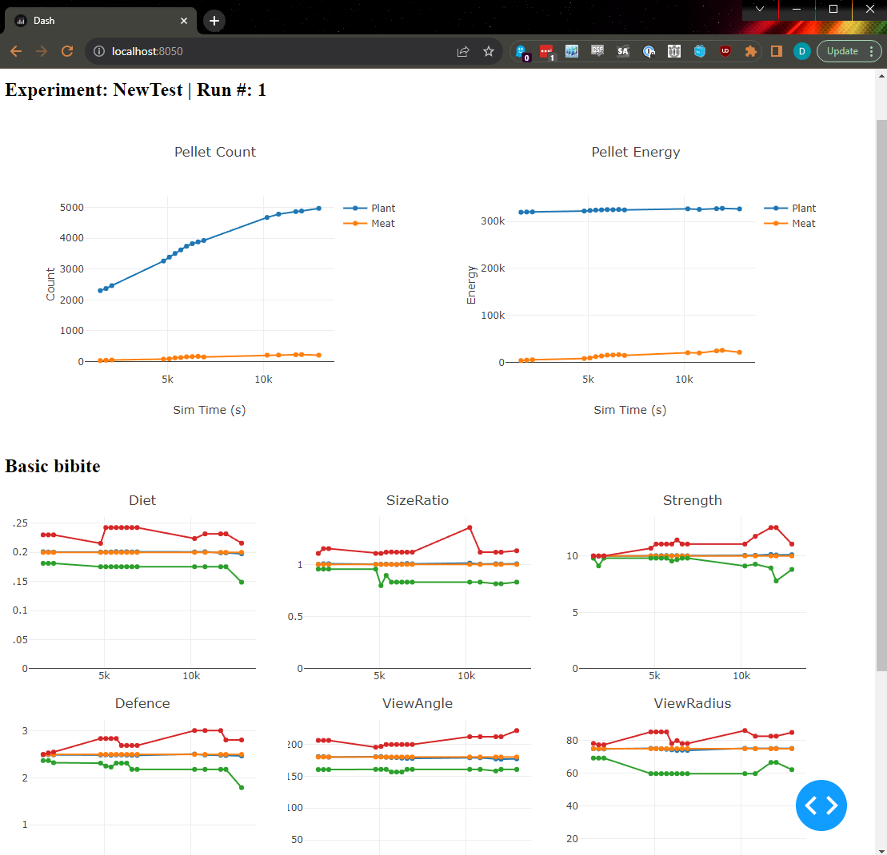

# Bibites Experiment Recording

**At the time of posting, this only supports Alpha 0.6a7** - the game is in active development, which means the save format is in active development.  Unfortunately, this means that supporting multiple versions of save formats is nontrivial.  Please feel free to submit a PR if you get it working for a different version, and I'll make a release tag for it.

Hi, I made this to record timeseries data from Bibites so that I can better understand how the different species are changing in relation to one another and the environment.  There's a lot that can be added and improved, but at the very least this gives some basic overviews of how species are changing over time.  This is set up to read data from autosaves, parse it out, send it to InfluxDB, then you can use Grafana to visualize it.  I'm using this to run an experiment multiple times (sometimes simultaneously across multiple bibites clients), and then aggregate the results for comparison without having to watch the simulation 24/7.

I'm not a data scientist, so I'm sure there's a lot that can be improved here.  If you have any suggestions, please feel free to submit a PR or open an issue.  Also if you do figure out how to get all of this going and wanna submit a quick PR to improve these docs, that'd be cool too.

## Setup - Infrastructure

**At the time of posting, this only supports Alpha 0.6a7**

I'm using Grafana Cloud and InfluxDB Cloud.
Grafana Cloud: https://grafana.com/products/cloud/
InfluxDB: https://www.influxdata.com/products/influxdb-cloud/

### InfluxDB
Sign up, make an account, make an org, and then make a bucket.  Also make a token granting access to the bucket or everything.

### Grafana
Hook up InfluxDB as a data source in Grafana.  Name it "Influx Cloud" or else it won't work.  InfluxDB has docs that explain how to do this here: https://docs.influxdata.com/influxdb/cloud-serverless/process-data/visualize/grafana/ but the docs LIE TO YOU in a few places.  Use InfluxQL - don't worry about FlightSQL (unless you wanna struggle for an hour like I did trying to get it running).  Also use the `Flux` query language when you set up InfluxDB as a data source.  I didn't need to set a user or password.  I used the organization and set the default bucket to one that I created, then I made an API key granting full access, and put that in as a token.  Zip zop, baby.  If you run into problems, ask ChatGPT and/or google first please.

Also feel free to import the `basicdashboard.json` file as a dashboard into grafana.

## Setup - Local

**At the time of posting, this only supports Alpha 0.6a7**

Use `pip` or `pip3` or `python3 -m pip` or whatever with the `-r requirements.txt` flag to install all the required packages.  Create a `config.json` file in the root of this dir with the following format:

    {
        "url": "[click the second from the top left word in the influxdb cloud page, then `settings` to see your cluster url]",
        "token": "[that token you made]",
        "org": "[top left word in the influxdb cloud page.  Influxdb calls it your account in some places on their UI.  Don't trust them]",
        "bucket": "[the bucket you made]",
        "autosavePath": "[path to where your game autosaves]",
        "savefileArchivePath": "[path to all of your autosaves that you've archived]"
    }

## Setup - Bibites

The values are stored in InfluxDB under `scenario` and `run` tags - the idea being that you'll run a Scenario `N` times, and then you can filter grafana graphs off of that.  IDK if this is the best way to do it - it's my first day using InfluxDB.

To set these values, your first zone in your scenario needs to be named in the format `"[Scenario] [Run #]"`.  If you don't do this, it _will break_.

This works by parsing data from autosaves, so I would recommend increasing your autosave frequency.  Note as well that if you run multiple clients, some will run faster than others, so if you want consistent data, make sure that you uncheck `Real-time autosave period`

## Running it

Run `python ./src/main.py` or whatever the equivalent is for you

## Contributing

Submit a PR?  If you wanna set up linting and whatnot, that'd be cool.  I might get that going soon and might update these docs some more based on feedback (although please feel free to submit a PR doing so as well!).